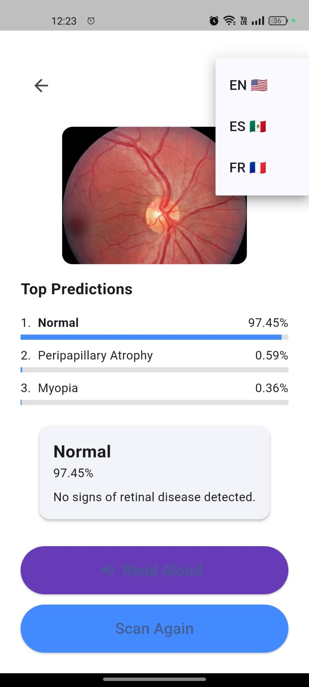
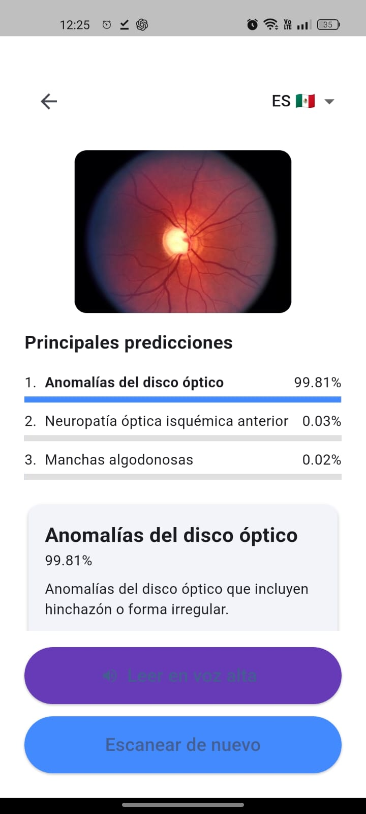

# OpticalApp 👁️📱

**Accessible AI-Powered Eye Disease Detection**

Created by **Alejandro Aguilar Martínez** – James Dyson Award Submission

---

## 📸 App Preview

  
  

🎥 **Watch the video demo**  

---

## 📦 APK Download

Download the latest version of the app from the GitHub [Releases](https://github.com/AlexPraxedes12/OpticalApp/releases).  
Test the app using your own fundus images or the ones provided in the `testing_images/` folder.

---

## 🔧 Build Your Own Adapter (DIY Manual)

To capture fundus eye images using a phone, I built a **low-cost adapter**:

**Materials used:**
- 1 small magnifying glass (lens diameter ~2 cm)
- Cardboard (any rigid piece)
- Black tape (to block external light)
- Optional: White paper to reduce reflections

**Assembly:**
1. Cut a small hole in the cardboard and tape the magnifying glass in place.
2. Align the lens with the phone’s main camera.
3. Create a tunnel using cardboard to reduce light interference.
4. Use your flashlight at an angle to avoid glare.

💡 This prototype cost less than **$0.50 USD** and worked well enough to test the app.  
Future versions aim for a more stable and replicable structure.

---

## 🧠 Technical Overview

- **Built with Flutter** (cross-platform mobile framework)
- **Model:** EfficientNet-B0 trained with **RFMiD dataset** (28+ diseases)
- **Runs fully offline** using TensorFlow Lite
- **Multilingual:** English, Spanish, and French
- **Voice explanation** with TTS
- Accepts **camera and gallery images**

---

## 💡 Inspiration

Originally this project started as a cancer detection idea, but later pivoted to ocular health — an area I grew passionate about due to personal and family experiences.  

---

## 🔁 Roadmap

- Collect more mobile-taken training images
- Improve adapter design
- Expand to iOS and web
- Add clinical validation and referral system

---

## 🤝 Contribute

Want to improve OpticalApp or use it in your community?  
Open an issue or fork this repo — contributions are welcome.

---

*Made with ❤️ for innovation in accessible visual healthcare.*
