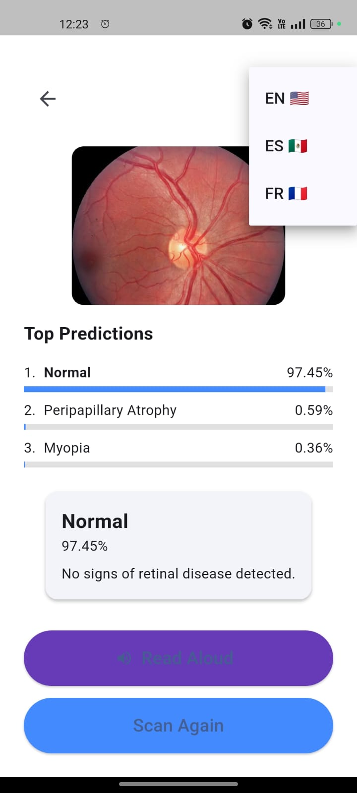
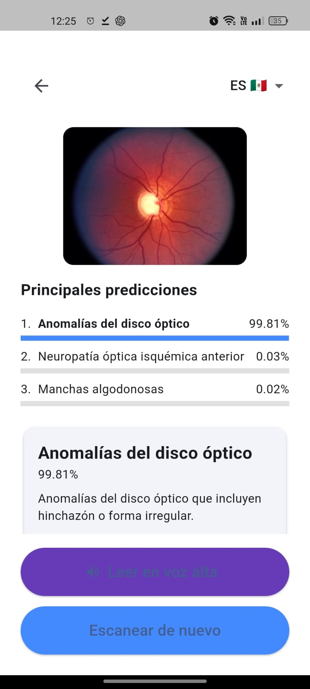
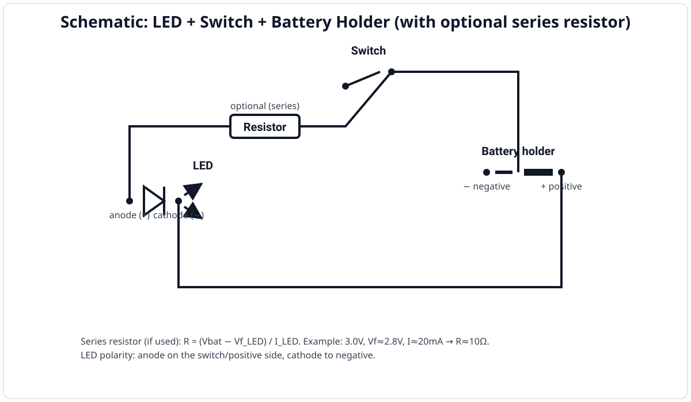

# OpticalApp — Accessible AI‑Powered Eye Screening + DIY Fundus Adapter

**Website:** **https://opticalapp.org**

  
  &nbsp;
  
  &nbsp;
  

> A practical, low‑cost approach to retinal screening on a smartphone.  
> OpticalApp runs **offline** on device (TensorFlow Lite) and pairs with a **DIY fundus adapter** you can build from a **cardboard tube** or **3D‑print** in an afternoon.

---

## 🌍 The Problem: Accessible Eye Screening for Everyone

Millions of people worldwide suffer from preventable vision loss due to conditions like diabetic retinopathy. Early screening is crucial, but professional fundus cameras cost thousands of dollars, limiting access in low‑resource communities.

**OpticalApp** tackles this challenge by transforming a standard smartphone into a capable retinal screening tool, making early detection more accessible—anywhere.

---

## 📸 App Preview

  
  

🎥 **Watch the video demo**  

---

## 📚 Table of Contents
- [Highlights](#-highlights)
- [DIY Fundus Adapter](#-diy-fundus-adapter)
  - [Option A — Cardboard Tube (with or without 20D)](#option-a--cardboard-tube-with-or-without-20d)
  - [Option B — 3D‑Printed Adapter](#option-b--3d-printed-adapter)
  - [Electrical schematic](#electrical-schematic)
  - [3D Model Files](#3d-model-files)
- [Lens Choice & Trade‑offs (20D vs magnifying glass)](#lens-choice--trade-offs-20d-vs-magnifying-glass)
- [Comparison with Commercial Solutions](#comparison-with-commercial-solutions)
- [Cost Summary](#-cost-summary)
- [Roadmap](#-roadmap)
- [Contributing](#-contributing)
- [Disclaimer](#-disclaimer)
- [License](#-license)

---

## ✨ Highlights

- **Flutter Mobile App:** Modern, fluid UI for Android.
- **On‑Device AI Model:** **EfficientNet‑B0** trained on **RFMiD**, converted to **TensorFlow Lite** for **100% offline** inference—protecting patient privacy.
- **Baseline Performance:** The current baseline achieves **Macro AUC = 0.687** and **F1‑Micro = 0.603**, showing on‑device feasibility for anomaly classification. *We welcome collaborators to improve performance further.*
- **Multilingual UI:** English, Spanish, and French with **Text‑to‑Speech** explanations.
- **Open & Replicable:** Two DIY adapters (**cardboard** or **3D‑printed**) that anyone can build.

---

## 🔧 DIY Fundus Adapter

Capture fundus images using either a **cardboard tube adapter** or a **3D‑printed adapter**. Both work with a simple **magnifying‑glass lens**; if you own an ophthalmic **20D lens**, you can adapt diameters and distances accordingly.

### Option A — Cardboard Tube (with or without 20D)
**Estimated cost:** **MXN $10** (~**$0.50 USD**)

**Bill of materials**
- Magnifying‑glass lens (~18–25 mm Ø) *or* **20D lens**
- Cardboard tube (paper‑towel/toilet‑paper) or rolled cardboard
- Black light‑blocking tape; scissors/cutter
- Optional: phone case + tape **or** a simple **cardboard cradle** to keep alignment
- **Lighting:** use the **phone’s flash** or an **external lamp** (no built‑in LED in this option)

**Build steps**
1. **Lens mount** — Cut a round window and tape the **magnifying lens** centered. For **20D**, add a ring spacer so it fits snugly.  
2. **Phone alignment** — Cut a rectangular window aligned with the phone’s main camera; hold/align the phone using tape or a simple **cardboard cradle** (no elastic bands).  
3. **Illumination** — Use the **phone flash** or an **external lamp**. To reduce glare, diffuse the flash with 1–2 layers of **matte tape** or a thin **translucent plastic cap**; if using an external light, keep it slightly **off‑axis**.  
4. **Blackout** — Wrap joints with black tape to block ambient light.  
5. **Focus** — Flash/light on; start a few centimeters away and approach slowly until the fundus is sharp. *(With a **20D** lens you’ll need a bit more working distance.)*

> **Note:** Option A has **no internal LED, switch or battery**. See Option B for a self‑contained lighting setup.

---

### Option B — 3D‑Printed Adapter
**Estimated cost:** **MXN $150** (~**$8.00 USD**) *(printing + small parts)*

**Files**
- `./3D_model/model.stl`
- `./3D_model/scad_funcional.scad` *(parametric: change lens Ø/thickness/offsets for magnifier vs 20D and re‑print)*

**Assembly (with LED)**
- Insert the **LED through the cylinder’s side hole** (slightly off‑axis) and add the **plastic‑cap diffuser**.  
- Glue the **slide switch** on the **side of the top rectangular base**.  
- Glue the **battery holder under the base**; route one wire through the **small pass‑through hole** you drilled.  
- **Wiring:** `(+ battery) → switch → (+ LED)` and `(− battery) → (− LED)`.  
  *Optional series resistor:* `R = (Vbat − Vf_LED) / I_LED` (e.g., 3.0 V, Vf≈2.8 V, I≈20 mA → R≈10 Ω).

---

### Electrical schematic

> The following circuit applies **only to Option B (3D‑printed)**.  
> Option A (cardboard) uses the phone flash or an external lamp and has **no internal lighting**.

---

### 3D Model Files
- [`./3D_model/model.stl`](./3D_model/model.stl)  
- [`./3D_model/scad_funcional.scad`](./3D_model/scad_funcional.scad)

Use any STL viewer or the project landing page to explore the model before printing. If you host a website/landing, ensure both the viewer and the download link point to `./3D_model/model.stl` and serve the site over **HTTP/HTTPS** (e.g., GitHub Pages).

---

## 🔭 Lens Choice & Trade‑offs (20D vs magnifying glass)

- **20D ophthalmic lens**  
  - ✅ Excellent optical quality; wider field of view; better edge sharpness.  
  - ⚠️ Typically **expensive** and requires **more working distance**; handling is less forgiving.  
  - 🔧 Use the `.scad` parameters to adapt holder depth/diameter.

- **Magnifying‑glass lens**  
  - ✅ **Ultra‑low cost** and easy to source; great for prototyping and education.  
  - ⚠️ Narrower FOV and more aberrations; focus is more sensitive.  
  - 💡 With a good **diffuser** and careful alignment you can still obtain useful images.

**Practical recommendation:** aim for a **middle ground** — design around a **magnifier** for accessibility, but keep the **parametric** `.scad` tunable so users who own a **20D** can swap lenses by editing diameter/thickness/offsets and re‑printing.

---

## ⚖️ Comparison with Commercial Solutions

| Aspect | Professional fundus cameras | Smartphone adapters (commercial) | **OpticalApp DIY** |
|---|---|---|---|
| Hardware cost | **$5,000–$25,000+ USD** | **$300–$1,500 USD** | **~$0.50–$8.00 USD (MXN $10–$150)** |
| Power & portability | Mains power / bulky | Portable | **Fully portable**, battery‑powered LED (Option B) |
| Operation | Trained operator | Easier, but proprietary | **Open & replicable**, step‑by‑step build |
| Model features | Software varies | Cloud/proprietary | **On‑device AI**, multilingual TTS |
| Customization | Low | Low–medium | **High** (OpenSCAD params, STL provided) |

*Note:* Commercial/clinic‑grade systems provide top optical performance and validated workflows. OpticalApp targets **accessibility, education, and community screening pilots**, not clinical diagnosis.

---

## 💰 Cost Summary

| Adapter | Estimated Cost |
|---|---|
| **Cardboard tube (magnifier or 20D)** | **MXN $10 (~$0.50 USD)** |
| **3D‑printed (parametric)** | **MXN $150 (~$8.00 USD)** |

---

## 🗺️ Roadmap
- **Improve Model Accuracy:** Collect more **mobile‑captured** training data and explore stronger architectures.  
- Iterate optical design (printed + cardboard)  
- iOS/Web support  
- Clinical validation & referral workflow

## 🤝 Contributing
Issues and PRs are welcome. Please share lens dimensions and your `.scad` parameters if you adapt to other lenses.

## ⚠️ Disclaimer
This project is **not a medical device**. Use for learning, prototyping, or community screening pilots. For clinical use, consult local regulations and an eye‑care professional.

## 📄 License
This project is licensed under the **MIT License**. See the `LICENSE` file for details.
